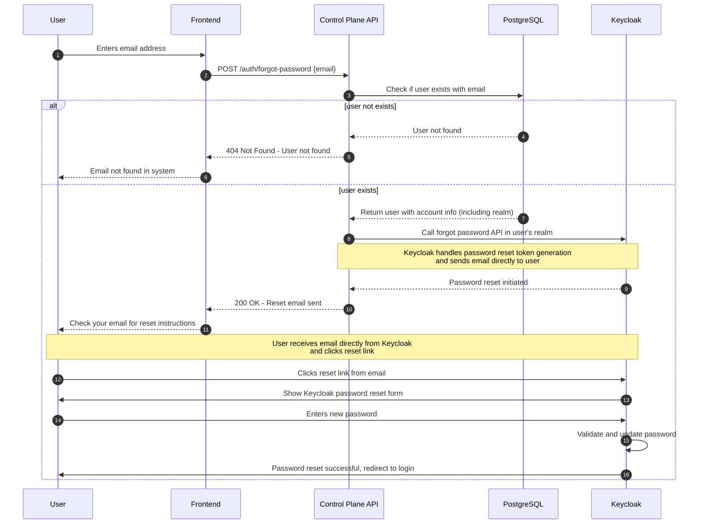

# Forgot Password Flow

## Flow Diagram

## Implementation

| File Path                                                 | Description                                                               |
| --------------------------------------------------------- | ------------------------------------------------------------------------- |
| `control-plane/src/routes/v1/auth.route.ts`                 | Defines HTTP routes for forgot password (e.g. `/v1/auth/forgot-password`) |
| `control-plane/src/services/auth.service.ts`                | Contains core business logic for triggering Keycloak password reset       |
| `control-plane/src/controllers/auth.controller.ts`          | Handles HTTP request/response for forgot password endpoints               |
| `control-plane/src/config/clients/keycloak-admin.client.ts` | Manages Keycloak Admin client for triggering password reset               |
| `control-plane/prisma/schema.prisma`                        | Database schema for user and account info (no token storage needed)       |

## Effect on Resources

Following are the list of resources affected after successful operation.

| Resource                         | Resource Type    | Effect                                                              | Status      |
| -------------------------------- | ---------------- | ------------------------------------------------------------------- | ----------- |
| `public.users`                   | Database table   | **User** record queried with email and account relationships        | Implemented |
| `public.accounts`                | Database table   | **Account** info retrieved via user.accounts relationship           | Implemented |
| `public.account_members`         | Database table   | **AccountMember** relationship queried to get realm info            | Implemented |
| `Keycloak Admin Client`          | Keycloak Service | **Admin client** initialized to access realm-specific operations    | Implemented |
| `Keycloak User Query`            | Keycloak API     | **User lookup** performed in each account's realm by email          | Implemented |
| `Keycloak Execute Actions Email` | Keycloak API     | **UPDATE_PASSWORD** action email sent with 5-minute lifespan        | Implemented |
| `Keycloak SMTP Service`          | Keycloak Email   | **Password reset email** sent directly by Keycloak to user          | Implemented |
| `public.audit_logs`              | Database table   | **AuditLog** records for password reset requests should be recorded | **TODO**    |

