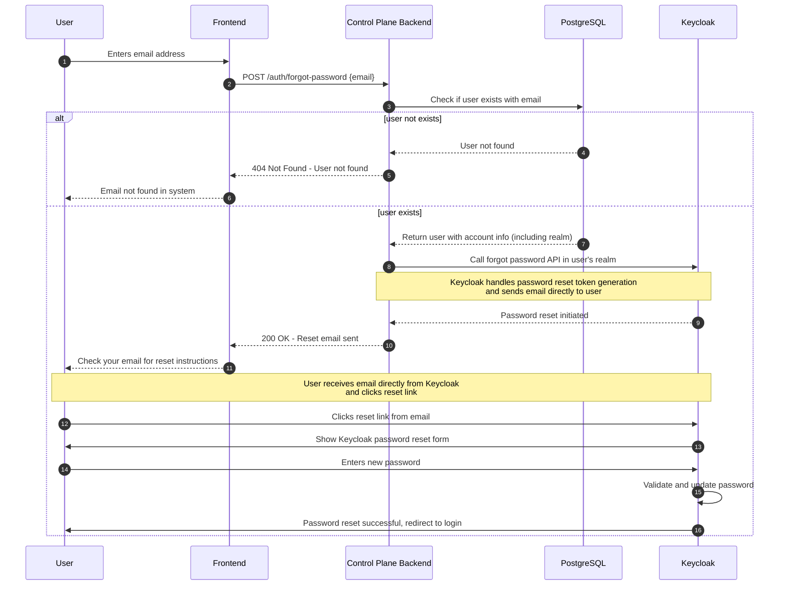

# Forgot Password Flow

## Flow Diagram

## Implementation

| File Path                                                 | Description                                                               |
| --------------------------------------------------------- | ------------------------------------------------------------------------- |
| `api-service/src/routes/v1/auth.route.ts`                 | Defines HTTP routes for forgot password (e.g. `/v1/auth/forgot-password`) |
| `api-service/src/services/auth.service.ts`                | Contains core business logic for triggering Keycloak password reset       |
| `api-service/src/controllers/auth.controller.ts`          | Handles HTTP request/response for forgot password endpoints               |
| `api-service/src/config/clients/keycloak-admin.client.ts` | Manages Keycloak Admin client for triggering password reset               |
| `api-service/prisma/schema.prisma`                        | Database schema for user and account info (no token storage needed)       |

