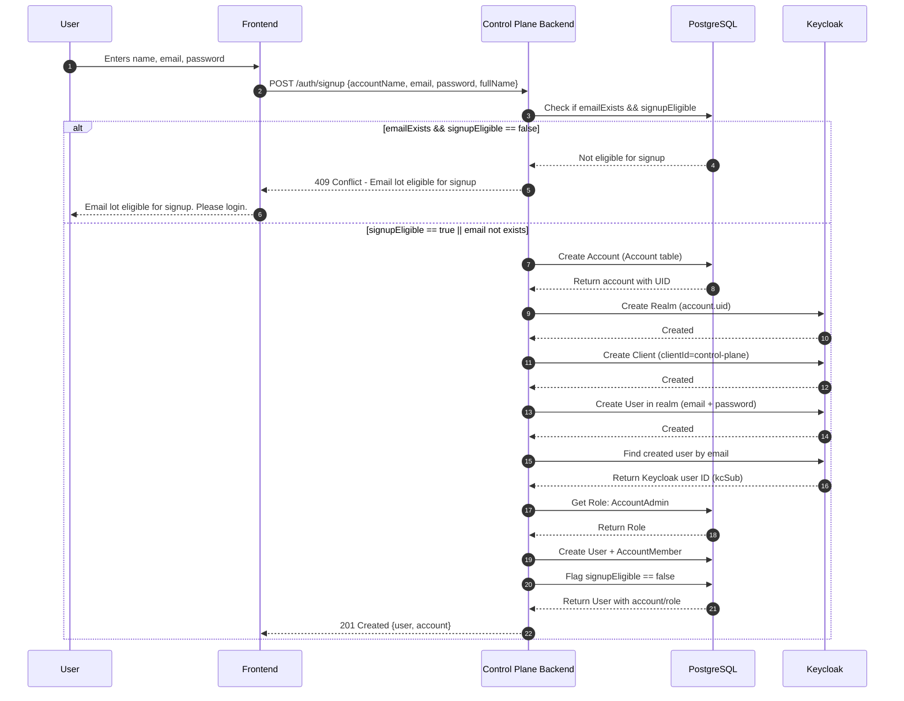

# Signup Flow

## Flow Diagram

## Implementation

| File Path                                                 | Description                                                         |
| --------------------------------------------------------- | ------------------------------------------------------------------- |
| `api-service/src/routes/v1/auth.route.ts`                 | Defines HTTP routes for authentication (e.g. `/v1/auth/signup`)     |
| `api-service/src/services/auth.service.ts`                | Contains core business logic for signup, login, user creation, etc. |
| `api-service/src/controllers/auth.controller.ts`          | Handles HTTP request/response, calls service methods                |
| `api-service/src/config/clients/keycloak-admin.client.ts` | Initializes and manages the Keycloak Admin client                   |
| `api-service/prisma/schema.prisma`                        | Defines the database schema (User, Account, Role, etc.) for Prisma  |
| `api-service/prisma/seed.ts`                              | Seeds initial roles like `Admin`, `AccountAdmin` into the database  |

## Effect on Resources
Following are the list of resources affected after succesful operation.

| Resource | Resource Type | Effect | Status |
| ---| --- | --- | --- |
| `public.accounts` | Database table | New __Account__ record with unique UUID created | Implemented |
| `Realm` | Keycloak Realm | New __Keycloak Realm__ created using `accounts.uid` as the name | Implemented |
| `Client` | Keycloak Client | New __Keycloak Client__ with `clientId=control-plane` is created | Implemented |
| `User` | Keycloak User | New __Keycloak User__ is created | Implemented |
| `public.users` | Database table | New __User__ record with unique UUID created | Implemented |
| `public.account_members` | Database table | New record mapping between __Account__, __User__, __Role__ is created | Implemented |
| `public.audit_logs` | Database table | Multiple __AuditLog__ records for each operation must be recorded | __TODO__ |
