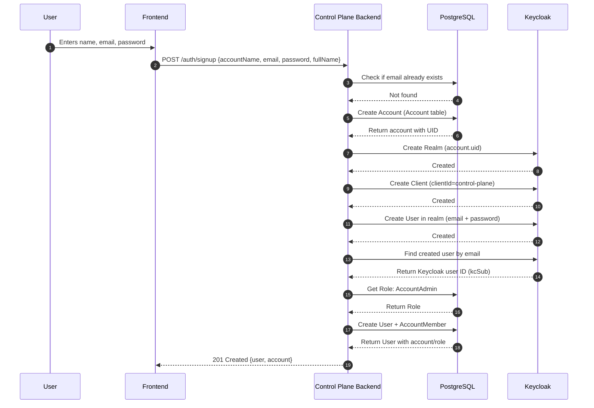

# Signup Flow

## Flow Diagram

## Implementation

| File Path                                                 | Description                                                         |
| --------------------------------------------------------- | ------------------------------------------------------------------- |
| `api-service/src/routes/v1/auth.route.ts`                 | Defines HTTP routes for authentication (e.g. `/v1/auth/signup`)     |
| `api-service/src/services/auth.service.ts`                | Contains core business logic for signup, login, user creation, etc. |
| `api-service/src/controllers/auth.controller.ts`          | Handles HTTP request/response, calls service methods                |
| `api-service/src/config/clients/keycloak-admin.client.ts` | Initializes and manages the Keycloak Admin client                   |
| `api-service/prisma/schema.prisma`                        | Defines the database schema (User, Account, Role, etc.) for Prisma  |
| `api-service/prisma/seed.ts`                              | Seeds initial roles like `Admin`, `AccountAdmin` into the database  |
